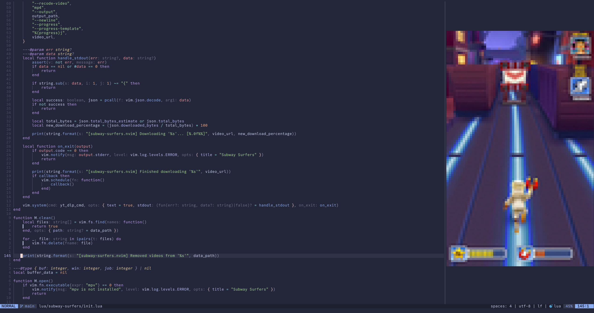

# subway-surfers.nvim 🏃🚇

Is your attention span cooked? Watch Subway Surfers gameplay in your favorite text editor!



## Installation

This plugin has a few requirements:

- nvim 0.10 or above
- [`mpv`](https://mpv.io/), for playback of the video
- [`yt-dlp`](https://github.com/yt-dlp/yt-dlp), for downloading the Subway Surfers YouTube video
- [`ffmpeg`](https://www.ffmpeg.org/), which is needed by `yt-dlp`

### [lazy.nvim](https://github.com/folke/lazy.nvim)

```lua
{
    "Facel3ss1/subway-surfers.nvim",
    cmd = { "SubwaySurfers" },
    config = true,
    -- Download gameplay video after install/update
    build = ":SubwaySurfers download",
}
```

### [packer.nvim](https://github.com/wbthomason/packer.nvim)

```lua
use {
    "Facel3ss1/subway-surfers.nvim",
    cmd = { "SubwaySurfers" },
    config = function()
        require("subway-surfers").setup()
    end,
    -- Download gameplay video after install/update
    run = ":SubwaySurfers download",
}
```

## Usage

To start playing the video, run `:SubwaySurfers` (equivalent to `:SubwaySurfers open`).

### `:SubwaySurfers open` and `open()`

This will run `:SubwaySurfers download` to download the video if it hasn't been downloaded yet, and then open a vertical split and start playing the video using `mpv`. Only one Subway Surfers window can be open at once, and running this command while a window is already open has no effect.

Running `:SubwaySurfers` with no subcommand runs `open` by default.

### `:SubwaySurfers close` and `close()`

This will close the Subway Surfers window and terminate the `mpv` process. You can also quit the window directly using `:q` or press the `q` key while focussed on the window - these will also kill `mpv`.

### `:SubwaySurfers download` and `download(callback?)`

This will download the Subway Surfers gameplay YouTube video as an mp4 in the background, using `yt-dlp` and `ffmpeg`. The video is saved to Neovim's data directory ([`:h standard-path`](https://neovim.io/doc/user/starting.html#standard-path)), in the `subway-surfers.nvim` directory. The video will not be downloaded if it already exists.

The Lua function `download()` takes an optional callback parameter that will be run once the download has completed. Note that the callback will still be run in the case where the video already exists.

### `:SubwaySurfers clean` and `clean()`

This will delete any files inside the `subway-surfers.nvim` data directory. You probably want to run this before uninstalling this plugin.
